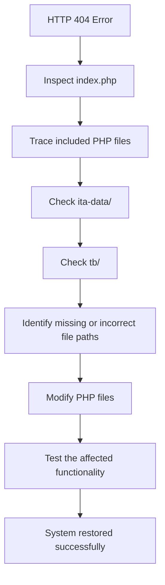

# Legacy PHP System Maintenance & Development

This project focused on developing and maintaining the ITA website for Kosamphi Nakhon Hospital to support the Integrity and Transparency Assessment (ITA) for the fiscal year 2024. The system was designed to provide accurate, accessible, and transparent information in accordance with the assessment criteria and hospital requirements, supporting the hospital in successfully completing its annual ITA assessment.

---

## Key Achievements

* **System Recovery:** Investigated routes, controllers, and PHP files to identify and resolve **HTTP 404 errors**, successfully restoring the system to a functional state.
* **Large-Scale Code Modification:** Modified and optimized more than **45+ PHP files** to restore and improve the system's functionality.
* **Real-World User Collaboration:** Worked directly with the **Insurance and Nursing Departments** under real-time pressure to translate user requirements into practical and functional system features.

---

## Project Structure

```text
├── ita-data/           # ITA-related data and system management
├── main-menu/          # Main menu structure
├── pages/              # PHP files for individual web pages
├── tb/                 # Database and table-related components
├── varaiable/          # Additional variable configuration files
├── index.php           # Main entry point of the system
├── index-xs.php        # Entry point for small/mobile screens
└── variable-ita.php    # Variables specific to the ITA system
```
---

## Tech Stack

- **PHP** (Legacy Version) — Backend development and server-side logic
- **HTML / CSS / JavaScript** — Frontend development and user interface
- **ITA (Integrity and Transparency Assessment)** — A system developed in accordance with ITA standards used by the Ministry of Public Health


---

## Debugging & Troubleshooting Process

When an **HTTP 404 error** was encountered, the issue was investigated by tracing the application's file structure and execution flow.


